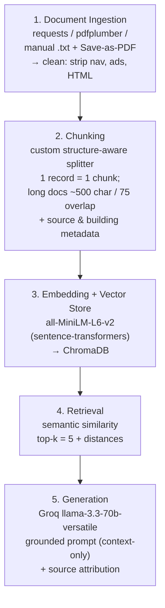

# Project 1 Planning: The Unofficial Guide

> Write this document before you write any pipeline code.
> Your spec and architecture diagram are what you'll use to direct AI tools (Claude, Copilot, etc.) to generate your implementation — the more specific they are, the more useful the generated code will be.
> Update the Retrieval Approach and Chunking Strategy sections if you change your approach during implementation.
> Update this file before starting any stretch features.

---

## Domain

I chose off-campus housing at the University of Illinois Urbana-Champaign (UIUC). Official channels like the listing sites, the leasing offices, the university's housing pages, will tell you a unit's rent, square footage, and amenities, but they won't tell you the things that actually decide whether you have a good year such as which landlords actually fix things, which buildings have noise, pests, or deposit-withholding problems, and whether a pricier Campustown high-rise is worth it over a cheaper apartment in an Urbana neighborhood. That lived-experience knowledge is real but scattered across Reddit threads, Google reviews, and word of mouth, and there's no single place to search it, which is exactly the gap this system fills. 

---

## Documents

<!-- List your specific sources: URLs, subreddit names, forum threads, or file descriptions.
     Aim for at least 10 sources that together cover different subtopics or perspectives within your domain. -->

| # | Source | Description | URL or location |
|---|--------|-------------|-----------------|
| 1 | OCCL (Off-Campus Community Living) | Official UIUC off-campus office for subleasing, security deposits, lease/legal tips, scam avoidance | https://occl.illinois.edu/ |
| 2 | College Pads | Listings with rent + walking distance to campus | https://www.rentcollegepads.com/off-campus-housing/urbana-champaign/search |
| 3 | Apartments.com (UIUC off-campus) | Listings + resident reviews + neighborhood breakdown (Campustown / Midtown / Downtown) | https://www.apartments.com/off-campus-housing/il/champaign/university-of-illinois-at-urbana-champaign/ |
| 4 | Redfin (61820 rentals) | Per-unit hard facts: rent, sqft, in-unit laundry, dishwasher, A/C, deposit, availability date | https://www.redfin.com/zipcode/61820/apartments-under-1000-for-rent |
| 5 | Roland Realty | One major local landlord's units | https://www.roland-realty.com/ |
| 6 | American Campus Communities (Champaign) | Big Campustown high-rises (309 Green, Tower/Suites at Third) — amenities, location | https://www.americancampus.com/student-apartments/il/champaign |
| 7 | Amber Student (UIUC) | Verified listings + walking/driving/trapublic transport timing from university | https://amberstudent.com/places/search/university-of-illinois-urbana-2307266880079 |
| 8 | r/UIUC (search: "slumlord list") | Unofficial layer - landlords to avoid, maintenance/mold complaints, Campustown vs. Urbana debates. | https://www.reddit.com/r/UIUC/comments/1qsl5ad/central_illinois_slumlord_list/ |
| 9 | r/UIUC (search: "roland realty") | Roland Realty reviews/complains. | https://https://www.reddit.com/r/UIUC/comments/1d7q6is/roland_realty/ |
| 10 | | | |

---

## Chunking Strategy

<!-- How will you split documents into chunks?
     State your chunk size (in tokens or characters), overlap size, and explain why those
     numbers fit the structure of your documents.
     A review-heavy corpus warrants different chunking than a long FAQ. -->

**Chunk size:** target ~500 characters (~ 100-125 tokens), hard cap below the embedding model's 256-token limit.

**Overlap:** ~75 characters, applied only when a long document is split.

**Reasoning:**
**Strategies considered:**
- **Recursive**, split on a prioritized list of separators (paragraph `\n\n`, sentence, word), recursively falling back to a finer separator only when a piece still exceeds the size cap. Respects natural boundaries *and* enforces a max size. 

**Why recursive fits a *heterogeneous* corpus.** My documents come in very different shapes, a one-line listing fact, a three-sentence review, a multi-paragraph OCCL legal page, so I apply the recursive splitter with content-aware handling rather than chopping everything uniformly:

- **Short reviews and listing records** are already under ~500 characters, so the recursive splitter leaves them intact: **one record = one chunk**. A building's facts and the opinion about it stay together and stay attributable.
- **Long OCCL legal/FAQ pages** get split recursively on paragraph boundaries first, merging short paragraphs up to the ~500-character target, with ~75-character overlap so a key fact near a boundary (e.g. a deposit-return process step) appears in both adjacent chunks and stays retrievable.
- The ~500-char / ~100-token size keeps every chunk well under all-MiniLM-L6-v2's 256-token input limit (longer text is silently truncated), while staying large enough to carry a complete thought.
- Every chunk carries **metadata**: `source` (which site/file), `building`/`landlord` where identifiable, and the chunk's position, needed for source attribution and the metadata-filtering stretch feature.

I'll validate by printing 5 representative chunks (one listing, one review, one OCCL passage, plus two random) and confirming each reads as a complete, self-contained unit before embedding.

---

## Retrieval Approach

<!-- Which embedding model are you using (e.g., all-MiniLM-L6-v2 via sentence-transformers)?
     How many chunks will you retrieve per query (top-k)?
     If you were deploying this for real users and cost wasn't a constraint, what tradeoffs
     would you weigh in choosing a different embedding model — context length, multilingual
     support, accuracy on domain-specific text, latency? -->

**Embedding model:** `all-MiniLM-L6-v2` via `sentence-transformers` which runs locally, no API key, no rate limits, 384-dimensional embeddings, and fast on CPU. 

**Top-k:** start with **k = 5**. Too few (k=1–2) risks the relevant chunk not being in the set at all when a building is discussed across several reviews and too many dilutes the context with loosely related chunks that can pull generation off-target. I'll tune after seeing real distance scores on my eval queries.

**Production tradeoff reflection:**
- **Accuracy on domain text:** a larger model (e.g. `bge-large`, OpenAI `text-embedding-3-large`, or Cohere embeds) would likely capture nuanced, slangy review language and building nicknames better than MiniLM, which can treat informal terms as near-noise.
- **Multilingual support:** UIUC has a very large international student population, and some reviews/threads appear in other languages. A multilingual model (e.g. `paraphrase-multilingual-MiniLM` or Cohere multilingual) would retrieve those instead of dropping them.
- **Local vs. API:** local gives privacy and zero marginal cost but caps quality; an API gives better recall at the cost of latency, spend, and a network dependency. For a student tool, local MiniLM is the right default but for a real product serving many users, I'd A/B a hosted model and measure retrieval accuracy against a labeled query set before paying for it. 

---

## Evaluation Plan

<!-- List your 5 test questions with their expected correct answers.
     Questions should be specific enough that you can judge whether the system's response
     is right or wrong. "What are good dining halls?" is too vague.
     "What do students say about wait times at [dining hall name] during lunch?" is testable. -->

| # | Question | Expected answer |
|---|----------|-----------------|
| 1 | What is the monthly rent for a 2 bedroom unit at Legacy 202 (202 E Daniel St)? | $1,275  |
| 2 | Are pets allowed at Legacy 202 (202 E Daniel St)? | No |
| 3 | Which apartments within 1 mile walking distance of the Main Quad have in-unit laundry and rent under ~$1,000/month? | 1008 S Fourth, Champaign ($940), 501 S. Sixth, Champaign ($835). Note: this is a multi-unit answer spread across listings, if top-k is too low the system may return only one.  |
| 4 | According to resident/student reviews, what do people say about Roland Realty's management? | Most people commented that they were always very responsive and very helpful! never had any issues with them honestly, while some complained that the management changed and the new staff are terrible. |
| 5 | What is the legal deadline for a landlord to return a security deposit in Illinois, and what's the process if they don't? | The process should come from the OCCL document (cite it). For the statutory deadline, the system should only state it if it appears in a retrieved chunk, if it doesn't, it should say it lacks enough information rather than supplying the number from the model's training knowledge. |

---

## Anticipated Challenges

<!-- What could go wrong? Name at least two specific risks with reasoning.
     Consider: noisy or inconsistent documents, missing source attribution, off-topic
     retrieval, chunks that split key information across boundaries. -->

1. **Noisy, JS-rendered listing sources leave artifacts.** Sites like Apartments.com, Redfin, and the listing aggregators are JavaScript-heavy and wrapped in navigation, ads, boilerplate, and repeated headers. If cleaning is incomplete, chunks will contain nav text or HTML entities (`&amp;`, `&nbsp;`) that dilute the embedding and produce off-topic retrieval. Mitigation: print a raw vs cleaned document and inspect before chunking, use the Save-as-PDF / manual-copy fallback for pages that won't scrape cleanly.

2. **Building-name and address ambiguity splits or crosses signal.** Many buildings share landlords and near-identical addresses (a dozen things on "Green St"), so a query about one building can retrieve chunks about a different one, and a building discussed across several reviews can have its key fact land in a chunk that doesn't get retrieved. Mitigation: attach `building`/`landlord` metadata to every chunk, keep reviews as atomic chunks, and verify retrieval source on the eval queries.

---

## Architecture

<!-- Draw a diagram of your pipeline showing the five stages:
     Document Ingestion → Chunking → Embedding + Vector Store → Retrieval → Generation
     Label each stage with the tool or library you're using.
     You can use ASCII art, a Mermaid diagram, or embed a sketch as an image.
     You'll use this diagram as context when prompting AI tools to implement each stage. -->

---

## AI Tool Plan

<!-- For each part of the pipeline below, describe:
     - Which AI tool you plan to use (Claude, Copilot, ChatGPT, etc.)
     - What you'll give it as input (which sections of this planning.md, which requirements)
     - What you expect it to produce
     - How you'll verify the output matches your spec

     "I'll use AI to help me code" is not a plan.
     "I'll give Claude my Chunking Strategy section and ask it to implement chunk_text()
     with my specified chunk size and overlap" is a plan. -->

**Milestone 3 — Ingestion and chunking:**
Tool: Claude.
Input: The **Documents** and **Chunking Strategy** sections plus the architecture diagram above.Ask it to implement `load_documents()` (load local `.txt`/PDF files, strip navigation/ads/HTML, normalize whitespace) and `chunk_text()` implementing the structure-aware logic — one record per chunk for reviews/listings, paragraph-merge with ~500-char target and ~75-char overlap for long OCCL pages — attaching `source` and `building` metadata. 
Verify: Print 5 representative chunks and confirm each is self-contained, metadata is correct, and no chunk exceeds the token cap or contains HTML artifacts. I'll correct anything that doesn't match the spec and ask Claude to explain any code I don't follow.

**Milestone 4 — Embedding and retrieval:**
Tool: Claude.
Input: The **Retrieval Approach** section + diagram. Ask it to implement `embed_and_store()` (embed chunks with `all-MiniLM-L6-v2`, store in ChromaDB with metadata) and `retrieve(query, k=5)` returning chunks + distance scores + sources.
Verify: Run 3 of my eval questions (Q1, Q2, Q3), print returned chunks and distances, and confirm top results are on-topic with distance < 0.5. if not, debug chunking before touching generation. I'll ask Claude to explain any unfamiliar ChromaDB calls.

**Milestone 5 — Generation and interface:**
Tool: Claude.
Input: My grounding requirement (answer from retrieved context only and refuse when context is insufficient), the desired output format (answer + source list), and the Gradio skeleton. Ask it to wire `ask(query)` with a system prompt that enforces grounding ("answer using only the provided documents, if they don't contain enough information, say 'I don't have enough information on that'") and appends source names programmatically rather than trusting the LLM to cite. 
Verify: Run an out-of-scope dining query (must refuse) and Q5 (watch for an ungrounded Illinois-law answer), if the system answers from general knowledge, tighten the prompt and document the before/after.
